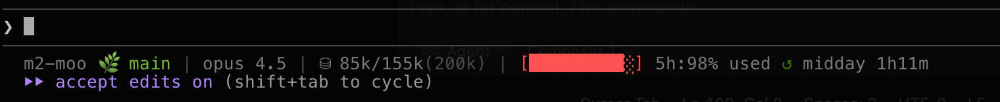

# Moo Statusline for Claude Code

A beautiful, informative statusline for Claude Code CLI that shows your project, git branch, model, context usage, and **real-time rate limit tracking** via the Anthropic API.

## Codex CLI

For a Codex-oriented copy of the script, see `statusline-codex.sh` and `README-CODEX.md`.

Quick run:
```bash
chmod +x ./statusline-codex.sh
echo '{"cwd":"'$PWD'","model":"gpt-5.2-codex","info":{"last_token_usage":{"total_tokens":6472},"model_context_window":258400},"rate_limits":{"primary":{"used_percent":24.0,"window_minutes":300,"resets_at":1767958180},"secondary":{"used_percent":3.0,"window_minutes":10080,"resets_at":1768212356}}}' | ./statusline-codex.sh
```

Live watcher (separate terminal):
```bash
chmod +x ./codex-statusline-watch.sh
./codex-statusline-watch.sh
```

## Features

- 🌿 **Git Integration** - Shows project name and current branch (highlighted in green)
- 🤖 **Model Display** - Simplified model names with version (e.g., opus 4.6, sonnet 4.5, haiku 4)
- 🧠 **Effort Indicator** - Shows thinking effort level as dots next to model name (●●• = medium; 5-dot scale on opus 4.7+ for xhigh/max)
- 🪾 **Worktree Detection** - Shows worktree name in light brown when working in a git worktree
- 📊 **Context Tracking** - Shows current usage vs auto-compact threshold (e.g., `⛁ 97k/155k`), respects `autoCompactWindow` setting
- ⚡ **Live Rate Limit Data** - Real 5-hour usage from Anthropic API with visual progress bar
- ⏰ **Smart Reset Timer** - Displays next reset time and countdown (e.g., `↺ 9pm 1h43m`)
- 🎨 **Color-Coded Warnings** - Orange/red alerts when context or rate limits are high
- 💰 **Extra Usage Tracking** - Shows extra usage progress bar and spend when 5-hour limit is reached
- 📈 **Weekly Usage** - Optional 7-day usage percentage when available

## What It Looks Like



```
repo 🌿 main | opus 4.6 ●●● | ⛁ 65k/155k | [██░░░░░░░░] 5h:24% used ↺9pm 1h43m
```

When 5-hour limit is reached with extra usage enabled:
```
repo 🌿 main | opus 4.6 ●●● | [█░░░░░░░░░] extra:12% used $515.00/$4250 | 5h:100% used ↺3pm.0h14m | w:63%
```

In a worktree:
```
repo 🌿 feature-branch 🪾 my-worktree | opus 4.6 ●●• | [██░░░░░░░░] 5h:24% used ↺9pm 1h43m
```

**Breakdown:**
- `repo 🌿 main` - Project name + git branch (branch in green #74BE33)
- `🪾 my-worktree` - Worktree name in light brown (only shown in git worktrees)
- `opus 4.6 ●●•` - Current model with version and effort level dots
  - `●●●` = high (default), `●●•` = medium, `●••` = low
  - Opus 4.7+ uses a 5-dot scale: `●●●●●` = max, `●●●●•` = xhigh, `●●●••` = high, `●●•••` = medium, `●••••` = low
  - Only shown for thinking-capable models (opus/sonnet, not haiku)
  - Reads from `/model` command, `CLAUDE_CODE_EFFORT_LEVEL` env var, or `alwaysThinkingEnabled` setting
- `⛁ 65k/500k` - Current context usage / compact threshold
  - With `autoCompactWindow`: used directly as threshold (e.g., `65k/500k`)
  - Without: defaults to `context_window_size - 45K` (e.g., `65k/155k`)
  - Turns orange when <20k remaining, red when <10k
- `[██░░░░░░░░] 5h:24% used` - 5-hour rate limit usage from Anthropic API
  - Visual bar + percentage
  - Gray: <50%, Yellow: 50-79%, Red: ≥80%
  - Shows `w:3%` if weekly data is available; at ≥50% also shows reset date and countdown (e.g., `w:87% ↺ 6mar-midday.3h18m`)
  - When 5h hits 100% and extra usage is enabled, shows extra usage bar (light orange) with dollar spend
- `↺9pm 1h43m` - Next reset time + countdown
  - Icon in dark green (#357500)
  - Clean time format: `9pm` not `9:00pm`

## Installation

### Plugin Install (Recommended)

```bash
# 1. Add the plugin to Claude Code
claude plugins add github:moogento/moo-statusline

# 2. Run the setup command
/statusline

# 3. Restart Claude Code
```

### Homebrew (macOS)

```bash
# 1. Tap and install
brew tap moogento/moo-statusline
brew install moo-statusline

# 2. Add to your Claude Code settings (~/.claude/settings.json):
{
  "statusLine": {
    "type": "command",
    "command": "bash ~/.claude/statusline.sh"
  }
}

# 3. Restart Claude Code
```

### Quick Install

```bash
# 1. Download the statusline script
curl -o ~/.claude/statusline.sh https://raw.githubusercontent.com/moogento/moo-statusline/main/statusline.sh
chmod +x ~/.claude/statusline.sh

# 2. Add to your Claude Code settings
# Edit ~/.claude/settings.json (global) or .claude/settings.json (project-specific)
{
  "statusLine": {
    "type": "command",
    "command": "bash ~/.claude/statusline.sh"
  }
}

# 3. Restart Claude Code
```

### Manual Install

1. **Copy the script:**
   ```bash
   cp statusline.sh ~/.claude/statusline.sh
   chmod +x ~/.claude/statusline.sh
   ```

2. **Configure Claude Code:**

   Edit `~/.claude/settings.json` (for global settings) or `.claude/settings.json` (for project-specific settings):

   ```json
   {
     "statusLine": {
       "type": "command",
       "command": "bash ~/.claude/statusline.sh"
     }
   }
   ```

3. **Restart Claude Code** to see the statusline in action.

## Requirements

- **Claude Code CLI** (version 2.0.76 or later)
- **macOS or Linux**
  - macOS: Uses Keychain for OAuth token
  - Linux: Uses `secret-tool` (GNOME Keyring) or `~/.claude/credentials.json`
- **jq** - JSON processor
  - macOS: `brew install jq`
  - Linux: `apt install jq` or `yum install jq`
- **Git** (for branch display)
- **Bash** shell
- **Active Claude Code session** (must be logged in for API access)

## Customization

### Colors

The statusline uses RGB color codes. You can customize these in the script:

```bash
GRAY=$'\033[38;2;121;121;122m'          # #79797A - Main text
DARK_GRAY=$'\033[38;2;74;74;74m'        # #4A4A4A - Pipe separators
GREEN=$'\033[38;2;116;190;51m'          # #74BE33 - Git branch
DARK_GREEN=$'\033[38;2;53;117;0m'       # #357500 - Reset icon (↺)
YELLOW=$'\033[38;2;255;193;7m'          # #FFC107 - Rate limit warning (50-79%)
DARK_ORANGE=$'\033[38;2;204;122;0m'     # #CC7A00 - Context warning (70-84%)
LIGHT_BROWN=$'\033[38;2;181;137;80m'   # #B58950 - Worktree name
LIGHT_ORANGE=$'\033[38;2;255;179;71m'  # #FFB347 - Extra usage bar
RED=$'\033[38;2;255;82;82m'             # #FF5252 - Critical (≥80% rate limit, ≥85% context)
```

### Auto-Compact Threshold

By default, the context display uses `window_size - 45K` as the compact threshold (matching Claude Code's default). If you set `autoCompactWindow` in your Claude Code settings, the statusline uses that as the effective window instead:

```json
// .claude/settings.local.json
{
  "autoCompactWindow": 500000
}
```

This shows `⛁ 65k/500k` — compaction triggers at 500K. When `autoCompactWindow` is set, it's used directly as the compact threshold.

Without the setting, the default compact threshold is `context_window_size - 45K`, shown as `⛁ 65k/155k`.

Settings are read in priority order: project `settings.local.json` > project `settings.json` > global `settings.local.json` > global `settings.json`.

### API Cache Duration

The script caches Anthropic API responses for 60 seconds to avoid rate limits. Adjust if needed:

```bash
CACHE_MAX_AGE=60  # seconds
```

### Hide Segments

You can hide specific segments using environment variables. Set these in your shell profile or Claude Code settings:

```bash
export MOO_HIDE_GIT=1      # Hide git branch
export MOO_HIDE_CONTEXT=1  # Hide context usage
export MOO_HIDE_WEEKLY=1   # Hide weekly percentage
export MOO_HIDE_RESET=1    # Hide reset timer
```

## How It Works

The statusline script:

1. **Receives JSON input** from Claude Code via stdin (model info, workspace, context usage)
2. **Detects git branch** if in a git repository (and worktree if applicable)
3. **Fetches real usage data** from Anthropic OAuth API:
   - macOS: Retrieves OAuth token from Keychain (`security find-generic-password`)
   - Linux: Uses `secret-tool` or `~/.claude/credentials.json`
   - Calls `https://api.anthropic.com/api/oauth/usage` for live rate limit data
   - Caches results for 60 seconds to avoid API rate limits
4. **Parses API response** for:
   - `five_hour.utilization` - Current 5-hour usage percentage
   - `five_hour.resets_at` - UTC timestamp of next reset
   - `seven_day.utilization` - Weekly usage (if available)
   - `extra_usage.is_enabled` - Whether extra usage is active
   - `extra_usage.utilization` - Extra usage percentage
   - `extra_usage.used_credits` / `monthly_limit` - Dollar spend tracking
5. **Calculates context usage**:
   - Reads `autoCompactWindow` and `autoCompact` from the full Claude Code settings hierarchy (project local > project > global local > global)
   - `autoCompactWindow` is used directly as the compact threshold; without it, defaults to `context_window_size - 45K`
   - Converts to k format (e.g., `65k/500k` or `65k/155k`)
   - Color-codes based on remaining tokens until compaction
6. **Formats reset time**:
   - Parses UTC timestamp and converts to local time
   - Shows clean format: `9pm` instead of `9:00pm`
   - Rounds `:59` minutes up to next hour for clarity
7. **Outputs colored statusline** with ANSI RGB codes

Claude Code refreshes the statusline automatically every ~300ms.

## Troubleshooting

### Statusline not showing?

1. **Check script exists and is executable:**
   ```bash
   ls -la ~/.claude/statusline.sh
   ```
   Should show: `-rwxr-xr-x`

2. **Test the script manually:**
   ```bash
   echo '{"model":{"display_name":"Opus","id":"claude-opus-4-6"},"workspace":{"current_dir":"'$PWD'"}}' | ~/.claude/statusline.sh
   ```

3. **Verify settings.json syntax:**
   ```bash
   cat ~/.claude/settings.json | jq .
   ```

4. **Check jq is installed:**
   ```bash
   which jq
   ```

5. **Restart Claude Code completely**

### Rate limit showing as `[░░░░░░░░░░] --%`?

This means the API call is failing. Check:

1. **Verify you're logged in to Claude Code:**
   ```bash
   claude status
   ```

2. **Check OAuth token is accessible:**
   ```bash
   security find-generic-password -s "Claude Code-credentials" -w
   ```
   Should return JSON with OAuth credentials.

3. **Test API access manually:**
   ```bash
   # Get token
   TOKEN=$(security find-generic-password -s "Claude Code-credentials" -w | jq -r '.claudeAiOauth.accessToken')

   # Test API
   curl -s "https://api.anthropic.com/api/oauth/usage" \
     -H "Authorization: Bearer $TOKEN" \
     -H "anthropic-beta: oauth-2025-04-20"
   ```

4. **Check cache file:**
   ```bash
   cat /tmp/claude-usage-cache.json
   ```
   If corrupted, delete it: `rm /tmp/claude-usage-cache.json`

### Reset time showing wrong timezone?

The script uses `TZ=UTC` for parsing and `LC_TIME=C` for formatting. If times are still wrong, verify your system timezone:
```bash
date +%Z
```

### Escape codes showing as literal text?

Your terminal or Claude Code version may not support ANSI escape sequences. Try removing the color codes or updating to the latest Claude Code version.

### Shell/Terminal Issues

**iTerm2**: Works out of the box. Ensure you're using a recent version.

**Terminal.app (macOS)**: RGB colors require macOS 10.15+. Older versions may show incorrect colors.

**tmux**: Add to your `.tmux.conf`:
```bash
set -g default-terminal "xterm-256color"
set -ga terminal-overrides ",xterm-256color:Tc"
```

**screen**: RGB colors may not display correctly. Consider using tmux instead.

**Linux terminals**: Most modern terminals (GNOME Terminal, Konsole, Alacritty) support RGB colors. If colors don't work, check your `$TERM` variable:
```bash
echo $TERM
# Should be xterm-256color or similar
```

### API error indicator `[!]`?

If you see `[!]` before the progress bar, the API call is failing and no cached data is available. When the API fails but cached data exists, the cache is used silently. Common causes:
- OAuth token expired (re-login to Claude Code)
- Network issues
- API rate limiting

## Contributing

Contributions welcome! Feel free to:

- Report bugs via issues
- Submit pull requests for improvements
- Share your customizations
- Suggest new features

## License

MIT License - Feel free to use, modify, and distribute.

## Credits

Created for the Claude Code community. Inspired by the need for better context awareness and rate limit tracking.

---

**Tips:**
- The statusline updates automatically as you work (~300ms refresh)
- Watch `⛁` values turn orange/red to know when auto-compact is approaching
- Monitor the 5-hour rate limit bar to pace your usage
- Dark green `↺` icon marks the reset timer
- Weekly usage (`w:X%`) helps track longer-term patterns
- Cache refreshes every 60 seconds to keep data current without hammering the API
- Times are shown cleanly: `9pm` instead of `9:00pm`, `:59` rounds to next hour
